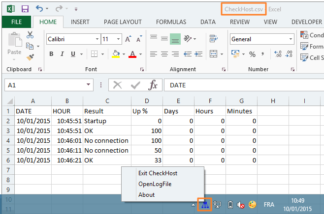

CheckHost
===========

I wrote this app in 2006 because my father's ISP sucked, and that he wanted to have stats about his connection status. So, on a given interval, this app will make <del>a DNS request</del> an http request and log the result, along with basic stats in a txt or a csv file. Nothing fancy, but might be useful.

One still has to launch it manually though.

Rewrote it in 2015 to make it more user friendly.

Icons by http://ipapun.deviantart.com/